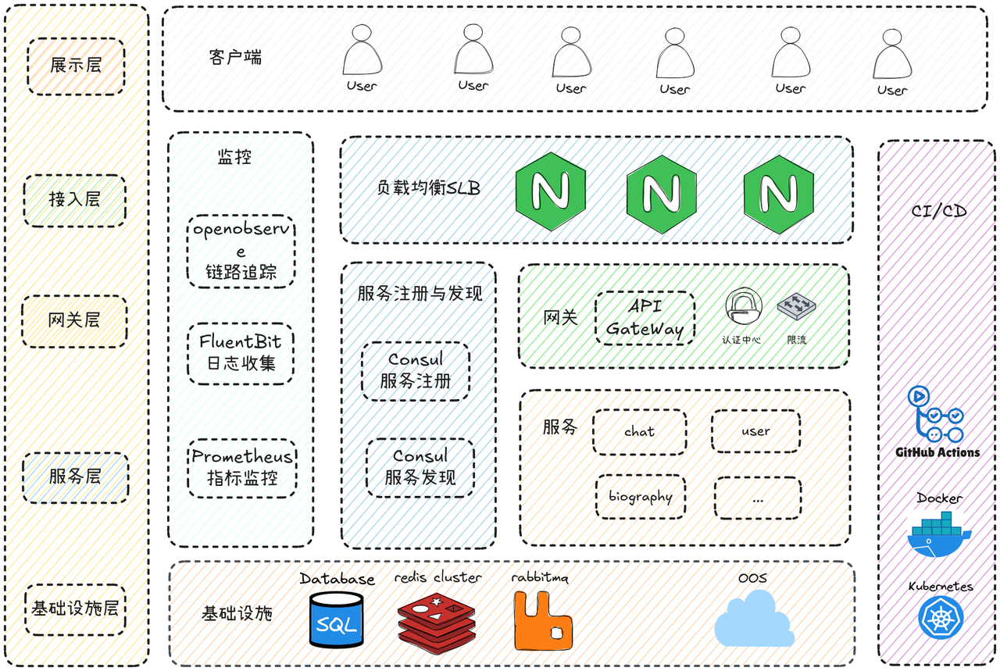

# 📖 简介
心忆灵伴 是一款极富创意的 Web 应用。它巧妙地将情感设置、智能聊天与 Live2D 技术深度融合，用户不仅能自由设定心情与 AI 开启充满温度的对话，还能看到生动鲜活的 Live2D 形象随心情和对话实时互动。此外，系统会根据聊天记录生成个性化回忆录，有效解决了传统聊天缺乏情感共鸣与个人经历留存不便的问题。
- 核心业务数据存储采用MySQL关系型数据库，结合Redis实现高效缓存与分布式锁机制，未来计划引入Milvus向量数据库支持更复杂的语义搜索场景。
- 系统通过RabbitMQ实现服务间异步解耦，特别针对数据库写入操作采用消息队列进行流量削峰，确保高并发场景下的系统稳定性。
- 采用Consul作为服务发现组件，配合Ingress-Nginx实现负载均衡，构建高可用的分布式系统基础设施。
- 全链路可观测性体系：采用OpenObserve构建日志系统。结合Prometheus实现指标监控。结合Prometheus实现指标监控。
- 容器化部署方案：开发环境使用Docker-compose快速搭建。开发环境使用Docker-compose快速搭建。通过GitHub Actions实现CI/CD全自动化流程。
# 🚀 功能演示
- [🎉 后端仓库地址](https://github.com/hahaha3w/3w3_Ai_Server)
- [💎 前端仓库地址](https://github.com/hahaha3w/3w3_Ai_Server)
- [📚 接口文档](https://apifox.com/apidoc/shared-b9a306cb-d028-4736-8b82-4e17ca1fbd86)
# 🖥️ 技术架构
架构总览

# 📦 使用方法
使用quickstart-compose.yaml一键部署